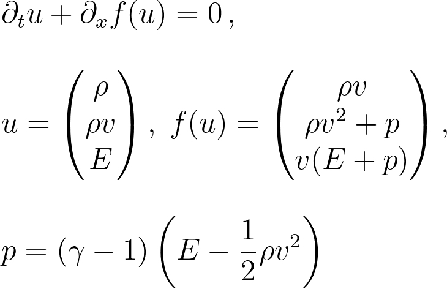
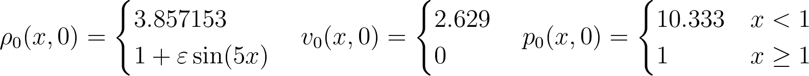
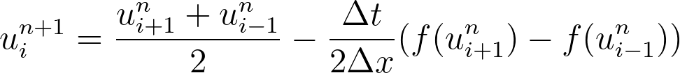
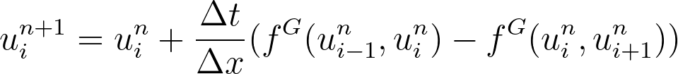
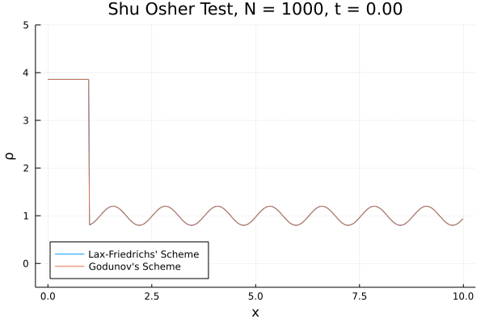

# Euler Equations
The Euler equations are a system of partial differential equations used in fluid dynamics which describe the flow of invicid fluids.

The parameter $\gamma$ is the heat capacity ratio also known as the adiabatic index. This system can be used to model airflow around a wing of an airplane for instance. Finding analytical solutions is pretty much impossible so we need to use numerical methods to approximate solutions.

# Shu-Osher Shock Tube Problem
To compare different numerical methods there are benchmark problems such as the Shu-Osher shock tube problem. This problem is given by the following initial conditions

with $\varepsilon = 0.2$ and the adiabatic index $\gamma$ of $1.4$. Notice that the given initial conditions do not correspond to the variables that govern the Euler equations. You need to convert them to fit the conservation variables of the system.

# Numerical Methods
## Lax-Friedrichs Scheme
The Lax-Friedrichs scheme is based on finite differences and is used to approximate solutions to hyperbolic partial differential equations.

To get to a stable method for a linear hyperbolic differential equation a viscosity term had to be added making the solutions smoother. Discontinuities or shocks in the solution will be smoothed out. The same goes for non-linear hyperbolic differential equations.

## Godunov Scheme
The Godunov schemes makes use of the exact solution to the Riemann problem at the boundary of two neighboring cells. This scheme is a lot better at preserving shocks in the solution.

Here $f^G(u_l,u_r)$ gives you the exact solution to the Riemann problem with flux at the boundary between the cells $i-1$ and $i$ or $i$ and $i+1$.

# Animation
Here is an animation of the solution to the Shu-Osher shock tube problem using the Lax-Friedrichs and Godunov scheme.

Even with a reasonable resolution of 1000 cells the solutions are wildly different. Clearly the Lax-Friedrichs scheme produces a smoother solution but the Godunov scheme is a lot closer to the reference solution for the shock tube problem.
Feel free to experiment with the code I have provided. The more cells you use the better the approximation becomes but beware of the added computational cost.
